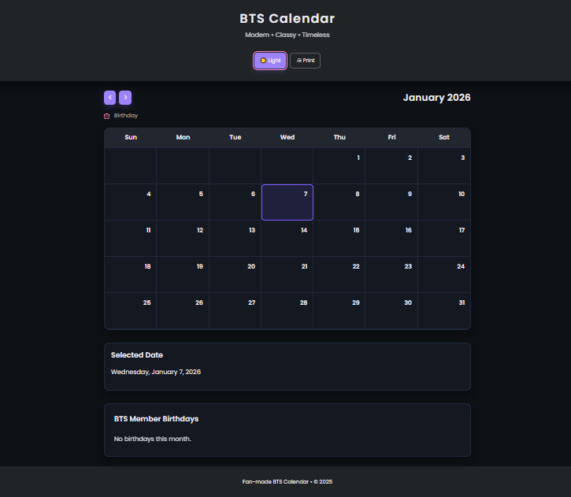
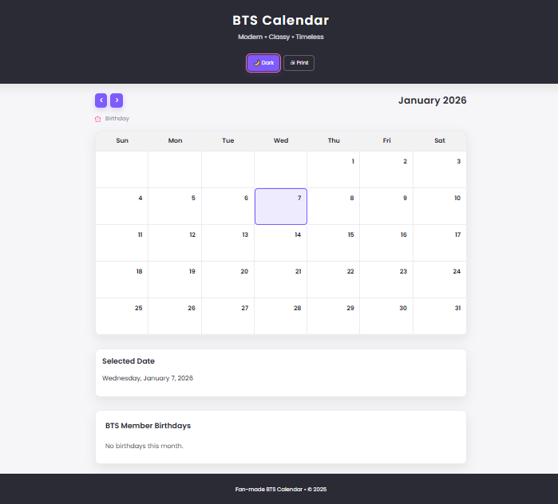

## BTS Fanbase Calender
A modern, classy, and timeless **fan-made BTS Calendar** built with **HTML, CSS, and JavaScript**.  
This interactive calendar highlights BTS member birthdays, anniversaries, and special events with a clean UI and playful design.

---

## ✨ Features
- 📅 **Dynamic Calendar Rendering** with month/year navigation
- 🌙 **Dark/Light Theme Toggle** (saved in localStorage)
- 🖨 **Print-Friendly Mode** with simplified layout
- 🎂 **Birthday & Anniversary Highlights** with icons and colored vertical lines
- 💜 **BTS Festa Events** auto-populated for June
- 📌 **Selected Date Details** section for event info
- ⌨️ **Keyboard Shortcuts**:
  - `←` / `→` arrows to navigate months
  - `Enter` to toggle theme
- 🎨 **Modern UI/UX** with gradients, glassmorphism, and smooth transitions

---

## 🛠️ Technologies Used
- **HTML5** – semantic structure
- **CSS3** – custom properties, responsive grid, animations
- **JavaScript (ES6)** – dynamic rendering, event handling, localStorage
- **Font Awesome** – icons for navigation and events

---

## ⚙️ JavaScript Logic Overview
The core functionality is powered by `Script.js`:

- **Calendar Rendering (`renderCalendar`)**
  - Dynamically builds the grid for each month
  - Highlights today’s date
  - Populates birthdays and Festa events with tags/icons
  - Updates the selected date details

- **Birthday & Event List (`renderBirthdayList`)**
  - Filters events by visible month
  - Displays birthdays/anniversaries with vertical colored lines:
    - 🍰 Birthday → Pink line
    - 🎉 / 💜 Anniversary → Yellow/Purple line
    - 🌍 / 🇺🇸 Other events → Blue line

- **Navigation**
  - Buttons (`prev`, `next`) to move between months
  - Dropdowns (`monthSelect`, `yearSelect`) for direct selection
  - Keyboard shortcuts for quick navigation

- **Theme Toggle**
  - Saves preference in `localStorage`
  - Updates button text dynamically (🌙 Dark / ☀️ Light)

- **Accessibility**
  - `aria-live` updates for month/year
  - Click events show full date details

---

## 🚀 Getting Started

### Installation
1. Clone the repository:
   ```bash
   git clone https://github.com/ChiFrontEnd/Calender.git

## 🎮 Usage
- Use the **month/year dropdowns** or navigation arrows to browse the calendar.  
- Click on a **date** to view event details in the "Selected Date" section.  
- Toggle between **dark/light mode** with the 🌙 button (your preference is saved automatically).  
- Print the calendar using the 🖨 button for a clean hard copy.  
- Use **keyboard shortcuts** for faster navigation:
  - `←` / `→` arrows → Navigate months  
  - `Enter` → Toggle theme  

---

## 📸 Screenshots



Example:  
- Light Mode → birthdays highlighted with pink accents  
- Dark Mode → immersive purple glow for ARMY vibes  

---

## 🤝 Contributing
Pull requests are welcome!  
For major changes, please open an issue first to discuss what you’d like to improve.  
Suggestions for new BTS events, UI polish, or ARMY-inspired features are especially encouraged 💜.  
